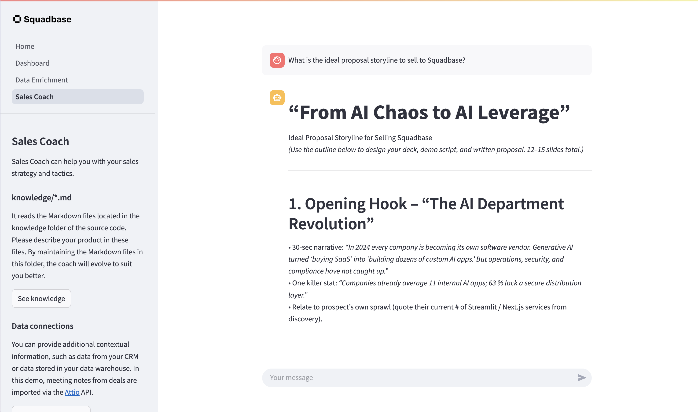

# 🧠👔 AI CRM (Streamlit)

This is an example of an AI-powered business app that integrates with your CRM data to strengthen the sales pipeline.
This project is developed as a multi-page app using [Streamlit](https://streamlit.io/) and is hosted on [Squadbase](https://squadbase.dev/).



→ Try it on Squadbase: _[Your deployed URL here]_

## Key Features

### Sales Coach

Sales Coach is a chatbot that ingests CRM data (via API) and markdown files placed within the project as context in order to provide users with precise, actionable advice. By feeding it the right context, you can train the bot to cater exactly to your needs.

- 🔹 Load data from your CRM via API
- 🔹 Load contexts from markdown files
- 🔹 Integrate with the OpenAI API and switch models at will

(More pages will be added soon)

---

## 🚀 Getting Started

Try the hosted version on Squadbase, or run it locally:

### 1. Clone the repository

```bash
git clone https://github.com/squadbase/ai-crm-streamlit.git
```

### 2. Install dependencies

```bash
uv sync
```

### 3. Set up your API keys

Fill in the required keys in the `.env` file:

```env
OPENAI_API_KEY=YOUR_OPENAI_API_KEY
ATTIO_ACCESS_TOKEN=YOUR_ATTIO_ACCESS_TOKEN
```

### 4. Run the app

```bash
streamlit run Home.py
```

---

## Deploy to Squadbase

Check out the [Squadbase documentation](https://squadbase.dev/docs/frameworks/streamlit) to learn how to deploy your app to Squadbase.
